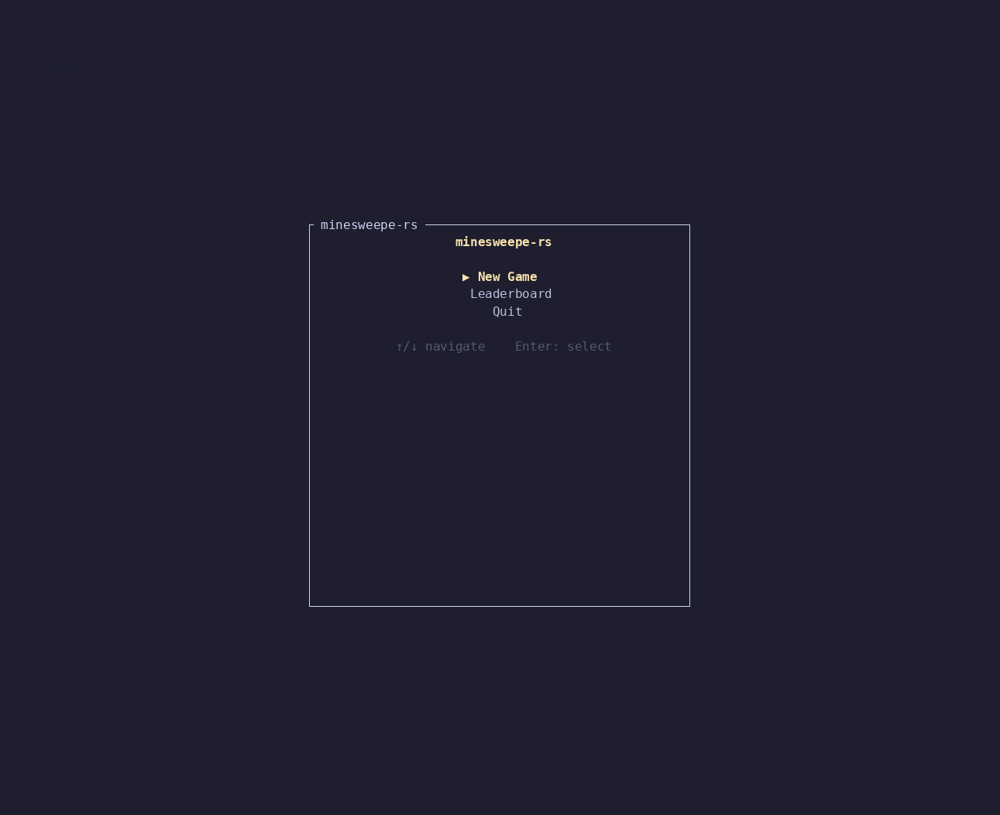

# minesweepe-rs

rust minesweeper. minesweeper in rust.



## install

```
cargo install minesweepe-rs
```

## controls

| action | keyboard | mouse |
|--------|----------|-------|
| move cursor | `hjkl` / arrow keys | — |
| reveal | `enter` / `space` | left-click |
| flag | `f` | right-click |
| reveal all neighbours | `enter` / `space` on revealed cell | left-click revealed cell |
| flag all neighbours | `f` on revealed cell | right-click revealed cell |
| menu | `esc` | — |
| quit | `q` | — |

flag cycles: hidden → flagged → question → hidden.

## leaderboard

times are recorded for beginner, intermediate, and expert. custom games are not ranked.
